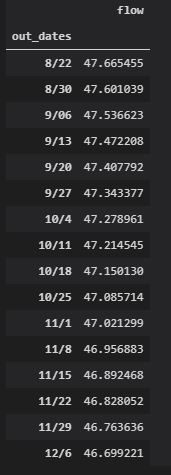

Ty   8/27   Assignment 6

---------
## Week 6, rushed this week ... started playing Factorio ... weekend disappeared

*my algorithm gets continually simpler as I lose faith in statistics*

I like your linear regression and plotting ... so I stole them.  The good thing about having historically bad predictions is that almost anything is an improvement.  Witness ... my linear regression attempt.   

# Answers to your questions

This will have to wait until next week ... sorry about that!

# Updated predictions

The last data that I considered was 8/21/2020.  I am slow to learn, but I am finally accepting that we are in a dry year ....

### Progress towards personal fulfillment
- Loving pandas, embracing more thoughtful plotting
- Have taken my domination to the world of factorio ... and lost
- Emojis spemojis
