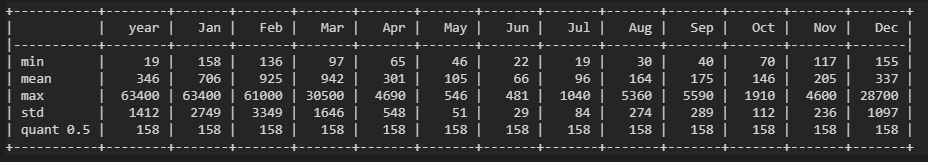
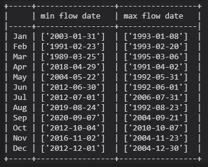
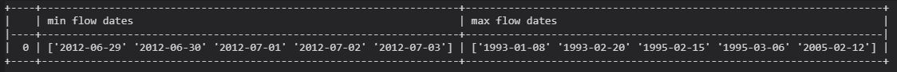

Ty   8/27   Assignment 4

---------
## Week 5, people, like it or not

*my algorithm gets continually simpler as I lose faith in statistics*

I simply adopt the lowest historic flow on the day starting each predicion window.  

# Answers to your questions

The columns are:  'agency_cd', 'site_no', 'datetime', 'flow', 'code', 'year', 'month', 'day'

The index is a sequential range: RangeIndex(start=0, stop=11573, step=1)

The data types of the columns are:
- agency_cd     object
- site_no        int64
- datetime      object
- flow         float64
- code          object
- year           int32
- month          int32
- day            int32

Monthly summary statistics

Timings of min and max flows for each month

The highest/lowest five flow dates over over the period of record.

It is probably a pretty clear indication that my estimates are too high ... but, I have 117 dates within 10% of my week 1 flow estimate!  A truncated list:

# My predictions

The last data that I considered was 8/21/2020.  I am slow to learn, but I am finally accepting that we are in a dry year ....

- 8/22	34.7
- 8/30	38.4
- 9/06	46.1
- 9/13	52.2
- 9/20	57.1
- 9/27	79.0
- 10/4	69.9
- 10/11	86.8
- 10/18	74.3
- 10/25	83.0
- 11/1	118.0
- 11/8	131.0
- 11/15	131.0
- 11/22	141.0
- 11/29	154.0
- 12/6	170.0

### Progress towards personal fulfillment

- I wandered in the dark for decades, ignoring Pandas ... now I have seen the light
- World does not seem to notice my efforts towards domination
- I never really wanted emojis
